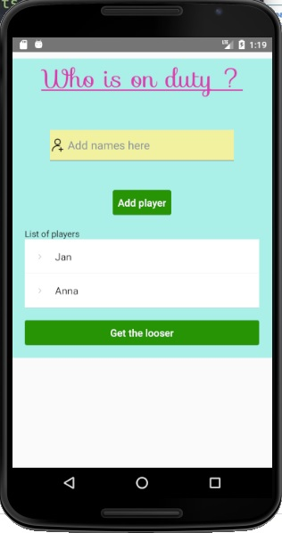
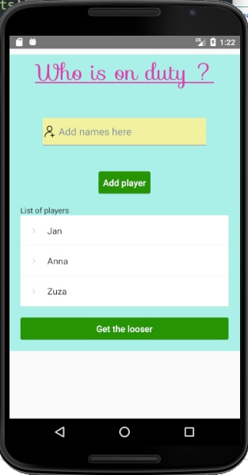
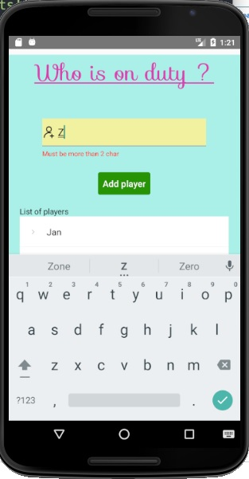
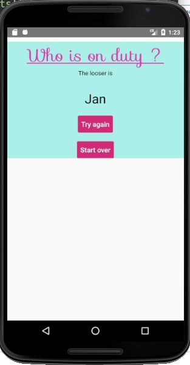

# whoisonduty

## Tabela zawartości
* [Podstawowe informacje](#podstawowe-informacje)
* [Technologie](#technologie)
* [Screeny](#screeny)
* [Setup](#setup)
* [Autor](#autor)
* [Nauczyciele](#nauczyciele)

## Podstawowe informacje
whoisonduty - aplikacja wykonana w ramach studiów w technologii natywnej React Native. Jest to losowy generator graczy, w tym przypadku osoby, która dziś ma służbę, np.zmywa naczynia lub wynosi śmieci. Można dodawać kilka osób (kilku graczy).
	
## Technologie

| Tech | Użycie
------------ | -------------
[Java](https://www.oracle.com/java/) | Język programowania
[JavaScript](https://en.wikipedia.org/wiki/JavaScript) | Język programowania
[React Native](https://reactnative.dev/) | Zestaw narzędzi do tworzenia natywnych, wieloplatformowych aplikacji, zwłaszcza mobilnych

## Screeny






## Setup

Zainstaluj odpowiednie pakiety.
Uruchom program:
```
npx create-expo-app AwesomeProject

cd AwesomeProject
npx expo start
```

## Autor
* **Gosia Różańska** - [manaroz](https://github.com/manaroz)
## Nauczyciele
* **Dariusz Kralewski** - *Nauczyciel akademicki na Uniwersytetcie Gdańskim w Gdańsku* - [Dariusz Kralewski](https://github.com/DariuszKralewski) - Dziękuję!
* **Coding Revolution** - *Course tutorial* - Dziękuję!
